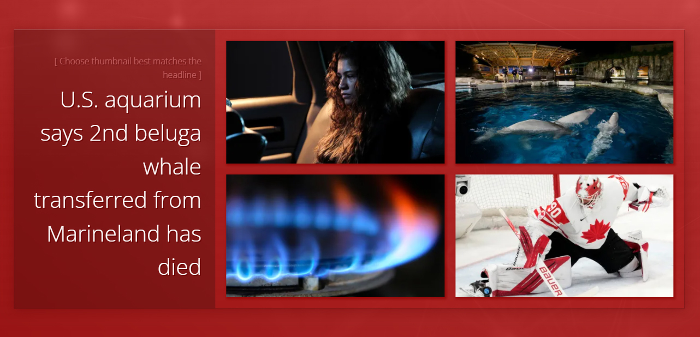

<h1 align="center">Match Headline and Thumbnail</h1>
<h4 align="center">Simple quiz app made in JavaScript</h4>

## Introduction
This is a quiz app called Match Headline and Thumbnail. Users select from a group of thumbnails, the image that best matches a provided headline. News data comes from CBC RSS in xml format, and it is translated to JSON via RSS to JSON online converter.

## How to Run the Project
Simply open ``index.html`` and it'll be ready to play.

## Live Demo

Click [here](https://suefrontend.github.io/match-headline-and-thumbnail-vanilla-js/) for live demo

## More Features to Add in the Future
- User login
- Track scores
- Calculate correct answer rate percentage
- One thumbnail and four headlines mode
- Change game mode button
- History page which news you have read
